# **Print-it Simulation Report**

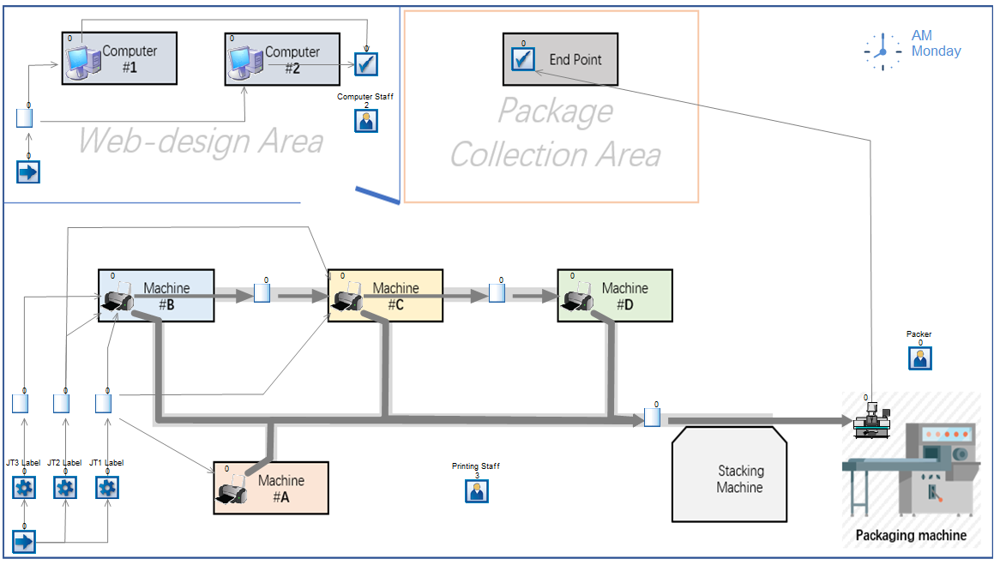

## 0 Table of Content

**1 Conceptual Model**

- 1.1 Problem Description
- 1.2 Objectives
- 1.3 Inputs
- 1.4 Outputs
- 1.5 Scope
- 1.6 Assumptions and Simplifications
- 1.7 Data Requirements

**2 Data Analysis**

- 2.1 Arrival Processes
- 2.2 Activity Times

**3 Verification & Validation**

- 3.1 Verification
- 3.2 Conceptual Model Validation
- 3.3 Whitebox Validation & Blackbox Validation
- 3.4 Data Validation

**4 Conclusion**

**5 Appendix**

## 1 Conceptual Model

### 1.1 Problem Description

Print-It! Company prints marketing materials and designs websites. They need to expand due to increased demand, and we've been asked to create a DES model to identify bottlenecks and areas for improvement. They also want suggestions for coping with a 20-30% demand increase.

### 1.2 Objectives

#### 1.2.1 Modelling Objectives

- **Achievement:** Identify areas to increase efficiency in terms of staff and resource usage rates. Ensure that the targets set out by the client are met and if they are not, suggest changes for them to be met.
- **Measuring Performance:**
  - Identify areas where jobs may stay in the system indefinitely
  - Time taken for each job type to be started
  - Time taken for each job type to be completed
  - Utilisation of staff and resources

- **Adaptations:** The client believes that they may require more staff members/shifts, machines, and computers to fulfil their current demand. Therefore we will include there as experimental factors that can be changed by the client.

- **Constraints:**
  - Must use staff/resources as efficiently as possible.
  - Job Type 1 can be processed by Machine A, B, or C
  - Job Type 2 can be processed by Machine B or C
  - Job Type 3 must be processed by Machine B, then C, then D
  - Machines A, B, C and computers require staff to operate

####  

#### 1.2.2 Project Objectives

- **Adaptable:** Allows changes of the following experimental factors: number of staff, staff allocation, number of machines/computers, staff shift and break patterns
- **Usability**: Simple interface to allow the client to run and understand the simulation
- **Run Period:** Four working weeks, 8:00-18:00 Monday-Friday
- **Run Speed:** Quick, to get large numbers for averages by the time frame
- **Visual Display**: 2D animation, custom graphics

 

### 1.3 Inputs

- Number of each type of staff
- Shift patterns
- Number of machines/computers

### 1.4 Outputs

- Staff utilisation
- Machine utilisation
- Time taken for each job to get from the start of the machines to the package collection area.
- Time Series Graph for the queue at the stacking machine, List 1, List 2, List 3, and List 4.
- Percentage of JT1s taking more than 2 hours before machine process.
- Percentage of JT2s taking more than 3 hours before machine process.
- Percentage of JT3s taking more than 1 hour before machine process.
- Percentage of JT4s taking no more than 8 hours before the start of development

### 1.5 Scope

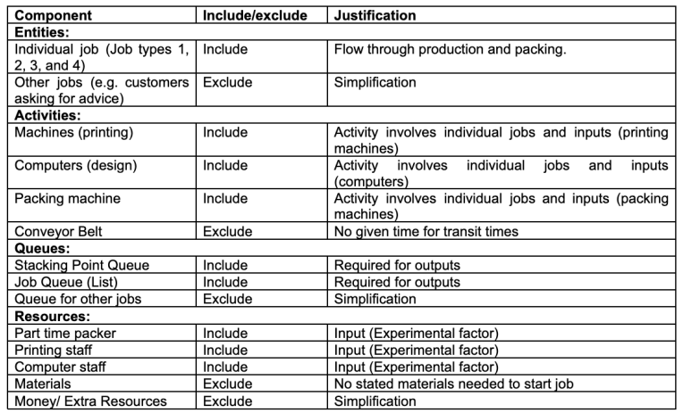

The corresponding level of detail table can be found in Appendix A.

### 1.6 Assumptions and Simplifications

​                        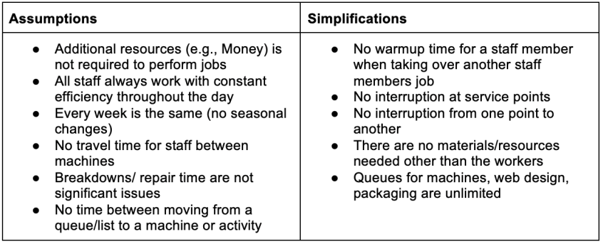

 

### 1.7 Data Requirements

​                       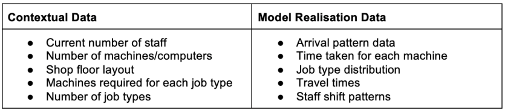

Model Run Time: From simulation runs, it is apparent that there is no natural endpoint as it is transient. Therefore, we have chosen to run the simulation for 4 weeks to identify the bottlenecks while also keeping the runtime fast to allow for multiple trial runs.

 

## 2 Data Analysis

This section outlines the data analysis carried out in model realisation including arrival processes and activity times using the raw data provided by the client.

### 2.1 Arrival Processes

In terms of arrival processes for both printing and website jobs, the client specified the probability distribution that describes the number of jobs arriving in one-hour intervals throughout a typical workweek. The arrival process is characterised by Poisson distributions with varying means throughout the day. The information on how the data is dealt with can be found in Appendix C. 

The probability distributions of arrival processes can be used to estimate the workload and resource requirements for the printing process during different times of the day and help in the optimization of the printing job scheduling process.

 

### 2.2 Activity Times

Statfit is used to fit the client-provided raw data to determine the distributions of activity times. The sample size of the data is 100 for each activity, we only considered distributions that are appropriate to model activity times and set reasonable lower bounds. A significance level of 0.05 is used for Anderson Darling (AD) and Kolmogorov Smirnov (KS) to test the goodness of fit of the distributions.

 

#### 2.2.1 *Machine A: Takes job from List 1*

Through visual inspection of the fitted density on the histogram, Uniform, Beta and Power function are well-fitting distributions of Machine A activity time (Appendix D.1). The continuous uniform distribution was chosen as the data in each interval seems to be equally distributed and it shows the closest fit of the data. A lower bound of 10 was set when fitting the data, this was considered reasonable as it was the minimum activity time shown in the data. This choice was confirmed by the goodness of fit tests where Uniform (10, 35) has p-values of 0.518 (KS) and 0.248 (AD), which are well above the significance levels and indicate that the observed data is likely to have been drawn from the uniform distribution. 

 

#### 2.2.2 *Machine B: Takes job from List 3, 2, 1 in order*

For machine B, the fitted density on the histogram shows that Weibull, Beta and Triangular are the well-fitting distributions (Appendix D.2). A lower bound of 4 was set as the minimum activity time. We’ve decided to use Weibull distribution here as it is ranked highest in Statfit and is appropriate in modelling time to complete a task. The goodness of fits tests find the Weibull distribution (3.65, 11.9) with a fixed offset of 4 fits the best with p-values of 0.946 (KS) and 0.944 (AD), which are well above the significance levels and indicate that the observed data is likely to have been drawn from the Weibull distribution. 

 

#### 2.2.3 *Machine C: Takes job from own queue (JT3), List 2, List 1 in order*

The fitted density on the histogram shows that Beta, Weibull and Triangular are the well-fitting distributions for the activity time of machine C (Appendix D.3). A lower bound of 4 was set as the minimum activity time. From visual inspection and the rankings, Beta distribution seems to give the best fit. We’ve decided to use Beta distribution as it is appropriate in modelling time to complete a task when the sample size of the data is relatively small. The goodness of fits tests find the Beta distribution (1.52, 2.16, 4, 42.8) with a fixed offset of 4 fits the best with p-values of 0.982 (KS) and 0.988 (AD), which are well above the significance levels and indicate the observed data is likely to have been drawn from the Beta distribution. 

 

#### 2.2.4 *Machine D: Takes job from own queue (JT3)*

Since the data of activity times for machine D only takes 3 values: 40, 80 and 100, meaning the activity times are usually fixed, a discrete distribution was considered to be suitable here. From the fitting result of Statfit, all the statistical distributions are rejected so a discrete empirical distribution was considered appropriate here. This can be done by creating a probability profile with inputted values and probabilities (Appendix D.4).

 

#### 2.2.5 *Job Type 4 (Website Jobs)*

For Job Type 4, there does not exists a well-fitted named distribution from the result of Statfit, hence an empirical distribution was used here to model the activity time (Appendix D.5). A lower bound of 197 was set to the empirical distribution. 

Athough empirical distribution provides a good fit of the data given, variability is limited to range in the data collected, which might not show the full picture of how the real system works (Lecture week 3).

 

#### 2.2.6 *Packaging*

As specified by the client, the distribution of the packaging time follows a continuous Uniform distribution with a lower bound of 1 minute and an upper bound of 3 minutes.

 

## 3 Verification & Validation

### 3.1 Verification

We began verification by comparing our Simul8 model to the conceptual model and Process Flow Diagram ([Appendix B](#_28h4qwu)). Visual checks ensured correct logic, data, routing, resource control, and labeling. Timing distributions were validated through black box validation. To verify other areas (routing, labelling etc.), we isolated parts of the model and used Monitor Simulation Mode to track down errors (Appendix E.2.1).

The Step-by-Step function helped us track entities so that we could compare them to our process-flow diagram. We also followed items and queues live using the watch window tool, which helped us with output recording (Appendix E.2.2). In addition, we used the Track work tool that allowed us to look at an entity throughout the whole simulation to check if the routing was set up as intended. In conclusion, after verification there is sufficient evidence that our computer model accurately represents the conceptual model.

 

### 3.2 Conceptual Model Validation

We used the Confidence/Impact framework to validate the conceptual model. We analyzed the assumptions and simplifications, and plotted them in a table (Appendix E.1). Both Confidence and Impact have a five-level scale from Low to High. High Confidence means high certainty that the assumptions hold in reality, while High Impact means a high likelihood of model failure if the assumption is not held. The Cause for Concern rating combines Confidence and Impact in the last column of the table. 

We found that the main cause for concern is the assumption that machine queue lengths have unlimited capacity, as the system is transient and the queues continue to fill up over time. If there were limits to queue capacity, the system could back up and face major issues.

 

#### 3.3 Whitebox Validation & Blackbox Validation

To check whether our model is a good approximation of the real system, whitebox validation and blackbox validation were carried out. To do this, multiple quantitative elements of the system were gathered and compared to the data given by the client. The data was gathered over 20 trials.

To make sure our model is representative of the real-world system, we have collected data on the time taken for each machine to complete each job. The averages of these are shown in the white-box validation table (Appendix E.3). From this table, we can see that the mean time taken for each machine is within a 95% confidence interval of the data observed in the real world. This implies that the distributions are correctly implemented in the simulation.

To carry out blackbox validation, we gathered the times taken for each job in each machine and compared that to the data given by the client. This was done by calculating a variety of statistical values to represent the data (Appendix E.4). From this data, we can see that the time taken in the simulation is an accurate representation of the real-world system.

Using both validation methods, we can conclude that the real-world system is accurately and appropriately simulated by this simulation.

 

#### 3.4 Data Validation

Sensitivity analysis was carried out on the statistical distributions used for the machine activity times, by running trials on and comparing both the empirical and statistical distributions. The trials returned almost identical results, indicating the activity times were not very sensitive and the choices made were appropriate. From the residual plots for Machine A, B and C, the chosen statistical distributions show a good fit of the input data, and the residual plots resemble a horizontal line (Appendix D). This means that we are confident that the used distributions are appropriate for modelling the activity times.

All the machines were set a lower bound on their activity times according to the raw data given, these assumptions were also validated through sensitivity analysis.

Similar analysis was performed on the arrival times of jobs and packaging times as well.

## 4 Conclusion

Overall, we have demonstrated that our simulation model accurately represents the Print-It! company, enabling the client to make informed decisions about necessary changes of experimental factors. It is clear that the system cannot handle the current demand and would require further adjustments to accommodate a 20-30% increase. Unfortunately, the client's objectives cannot be met as the queues continue to grow indefinitely due to the system's transient nature. Nevertheless, armed with the simulation, the client can identify the necessary changes to reach their goals.

## 5 Appendices

### Appendix A: Level of detail table

|             **Component**              |   **Detail**    |                     **Include/exclude**                      |              **Comment**               |
| :------------------------------------: | :-------------: | :----------------------------------------------------------: | :------------------------------------: |
|             **Entities:**              |                 |                                                              |                                        |
|             Individual Job             | Arrival Pattern |                           Include                            |            By Table 1 AND 2            |
| Each entity  represents one individual |     Include     |               No significant grouping observed               |                                        |
|            **Activities:**             |                 |                                                              |                                        |
|          Machines (printing)           |    Quantity     |                           Include                            |            4, labelled A-D             |
|                Resource                |     Include     | Printing staff (needs 1 staff member to operate it )  bar Machine D which needs no printing staff to operate |                                        |
|                 Roster                 |     Exclude     |              Available during all working hours              |                                        |
|                Routing                 |     Include     | For A, only takes from List 1  For B, takes from List 3, and if no jobs in list 3, it takes from 2,  and if there are no jobs in list 2, then take from list 1  For C, Take JT3 from B, otherwise take from JT2, and if there is no  job in List 2, then take from List 1  For D, take JT3 from C. |                                        |
|             Printing Time              |     Include     | Distribution of Printing Time is defined by spreadsheet for each  individual machine |                                        |
|            Breakdown/repair            |     Exclude     |          Not significant/ modelled in distribution           |                                        |
|           Computers (design)           |    Quantity     |                           Include                            |                   2                    |
|                Resource                |     Include     |               Only operated by Computer staff                |                                        |
|                 Roster                 |     Exclude     |         Available during working hours (8:00-18:00)          |                                        |
|                Routing                 |     Include     |                 Both go straight to delivery                 |                                        |
|            Breakdown/repair            |     Exclude     |           Not significant/modelled in distribution           |                                        |
|            Packing machine             |    Quantity     |                           Include                            |                   1                    |
|                Resource                |     Include     | Only operated by Packing staff (Available 2 hours a day from 3-5pm) |                                        |
|            Breakdown/repair            |     Exclude     |                       Not significant                        |                                        |
|              **Queues:**               |                 |                                                              |                                        |
|             Stacking Point             |   Discipline    |                           Include                            |       Last in, first out (LIFO)        |
|        Duration:Through Statfit        |     Include     |            Distribution data is relevant to task             |                                        |
|                Capacity                |     Exclude     |                       Assume unlimited                       |                                        |
|               Dwell time               |     Exclude     |                        No dwell time                         |                                        |
|          Baulking & reneging           |     Exclude     |                         Not relevant                         |                                        |
|              List Points               |     Routing     |                           Include                            |       First in, first out (FIFO)       |
|                Duration                |     Include     |                         Distribution                         |                                        |
|                Capacity                |     Exclude     |                       Assume unlimited                       |                                        |
|               Dwell time               |     Exclude     |                        No dwell time                         |                                        |
|          Baulking & reneging           |     Exclude     |                         Not relevant                         |                                        |
|             **Resources:**             |                 |                                                              |                                        |
|             Printing staff             |    Quantity     |                           Include                            |                   3                    |
|             Where required             |     Include     |                      Machines A, B & C                       |                                        |
|                 Shifts                 |     Include     |            08:00-18:00  Lunch break (12:00-13:00)            |                                        |
|              Skill level               |     Exclude     |                        Simplification                        |                                        |
|         Interruption to tasks          |     Exclude     |                          Assumption                          |                                        |
|             Computer staff             |    Quantity     |                           Include                            | 2 - dedicated - one staff per activity |
|             Where required             |     Include     |                          Comp 1 & 2                          |                                        |
|                 Shifts                 |     Include     |            8:00-18:00  Lunch break (12:00-13:00)             |                                        |
|              Skill level               |     Exclude     |                        Simplification                        |                                        |
|         Interruption to tasks          |     Exclude     |                          Assumption                          |                                        |
|             Packing staff              |    Quantity     |                           Include                            |                   1                    |
|             Where required             |     Include     |                       Printing machine                       |                                        |
|                 Shifts                 |     Include     |                    Working hours (3-5pm)                     |                                        |
|              Skill level               |     Exclude     |                        Simplification                        |                                        |
|         Interruption to tasks          |     Exclude     |                          Assumption                          |                                        |

 

### Appendix B: Process Flow Diagram

​     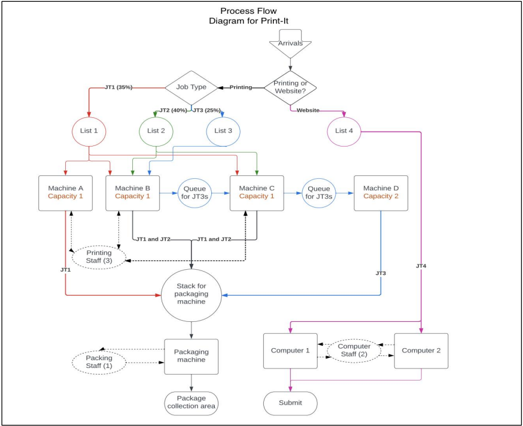

### Appendix C: Model Description

This model describes the process flow of a printing company called Print-It! This company operates from 8:00 to 18:00, Monday to Friday and the model will run for 4 weeks.

There are two types of jobs in the model of Print-it!: printing jobs and website jobs. The two types of jobs do not interact and are operated on different machines. Apart from the association in workflow, printing machines do not affect each other's efficiency and do not have significantly similar patterns of production time. This allows us to consider each part separately.

 

#### **Website Jobs**

Website jobs (JT4) are the simpler part of the system to model since they only need to be processed by one of two employees at one of two computers. The jobs enter the system with a frequency according to the distributions given by the client. The client specified that the number of jobs they receive per hour can be modelled by a Poisson distribution with varying means throughout the day. To obtain the average time between jobs in minutes from the number of jobs per hour, one can divide 60 by the expected jobs per hour. It is important to re-sample over-run times to the next slot since the jobs are so infrequent. This prevents a sample of 10 hours being taken in the morning preventing any jobs coming in throughout the day. This is done by creating a named distribution for each period in the day and a time-based distribution which assigns each named distribution to its corresponding time of day.

 When the jobs enter the system, they are added to List 4 where they can be accessed by the developers to start them. They are then completed by the same developer and sent off. The time taken for a website development job to be completed can be modelled using an empirical distribution which fits the data given by the client. Both employees take a one-hour break from 12:00 to 13:00.

 The travel time for this part of the model is zero because the jobs are entirely digital so the time to send/receive jobs is nearly instant. The client has specified that no job should be waiting more than 8 hours to be completed so the maximum queue time of List 4 is recorded.

 

#### **Printing Jobs**

The printing jobs are more complex since there are three different types (JT1, JT2, JT3) and they must be processed on multiple machines. Similar to the website jobs, the frequency that printing jobs enter the system is modelled by a Poisson distribution given by the client. This also varies throughout the day and the method of converting the expected jobs per hour to average time between jobs is the same.

When the jobs enter the system, they are sent to dummy activities where they are assigned a job type. These are distributed according to the following percentages: 35% Job Type 1, 40% Job Type 2, 25% Job Type 3. Once they are labelled, the jobs are sent to List 1, List 2, and List 3 accordingly. They remain in these queues until a machine is ready to accept them. The machines consider the jobs in order according to their type, Job Type 3 is a higher priority than Job Type 2 which is a higher priority than Job Type 1.

Machine A is very simple as it only takes jobs from List 1 and outputs everything to the packing stack. Machine B takes jobs from Lists 3, 2, and 1 in order and outputs jobs of type 3 to a queue for machine C. Machine B outputs other types of jobs to the packing stack. Machine C takes jobs from its own queue of Job Type 3s, then List 2, then list 1. It outputs Job Type 3s to a queue for machine D and the other types of job to the packing stack. Machine D takes jobs from its own queue and outputs everything to the packing stack. Machines A, B, and C require one of three printer operators to operate. These operators, like the website developers, take a one-hour break from 12:00 to 13:00. Machine D does not require an employee to operate and is able to process two jobs at a time.

Each machine takes a different amount of time according to the data given by the client. This data can be modelled using the following distributions:

- Machine A: Uniform (10,35)
- Machine B: Weibull (3.65,11.9) Offset 4
- Machine C: Beta (1.52, 2.16, 4, 42.8)
- Machine D: Empirical (10% 40 minutes, 25% 80 minutes, 65% 100 minutes)

The packing stack is a queue with LIFO etiquette, the first jobs that enter are the last to leave, the last jobs that enter are the first to leave. The packing machine is a simple, fast activity that requires the part-time packing worker to operate. However, the packing worker only works from 3pm to 5pm every day. Once the jobs are packed, they are considered completed and ready to be dispatched. 

 

#### **Targets and data collection**

To determine whether the targets set in the project brief are met, certain elements of data need to be collected. To determine how long a job takes before being processed, the time taken in List 1, 2, 3, or 4 is recorded. Additionally, the time taken for each job to be printed and packaged is calculated using a time stamp label. The label is set to the simulation time when a job leaves List 1, 2, or 3 and the time taken is calculated and stored when the job leaves the last activity. The time taken is the difference between the simulation time when the job is completed and the time stamp label.

 

#### **Job Travel Times**

Most of the travelling between activities is done digitally therefore the travel time can be considered instant. This includes all of Job Type 4 and the printing jobs before they are printed. When the jobs enter the physical world, the travel time stops being zero but is still very low.

### Appendix D: StatFit Data Analysis

#### **Appendix D.1: StatFit analysis – Machine A**

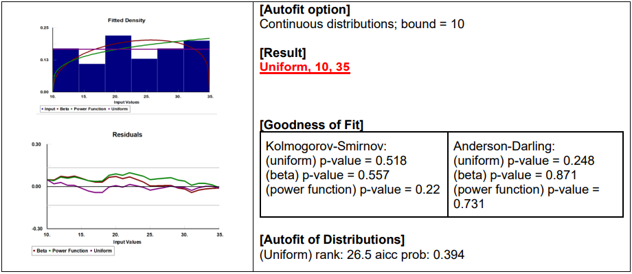

#### **Appendix D.2: StatFit analysis – Machine B**

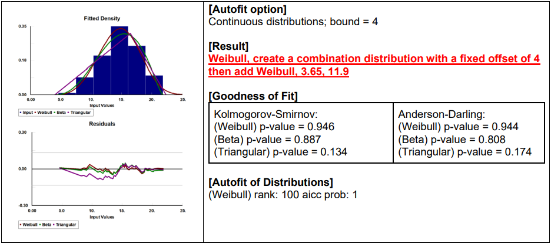

#### **Appendix D.3: StatFit analysis – Machine C**

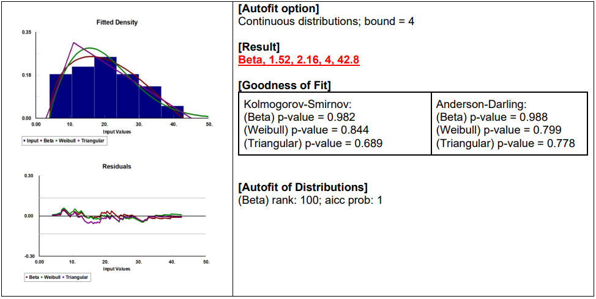

#### **Appendix D.4: StatFit analysis - Machine D** 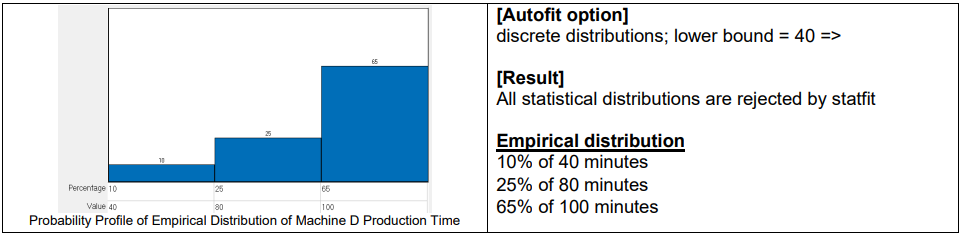

#### **Appendix D.5: StatFit analysis - JT4**

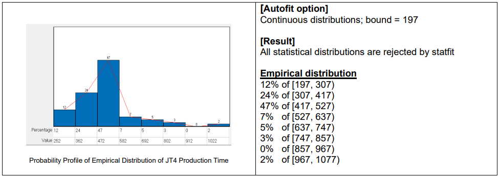

### Appendix E: Verification and Validation

#### **E.1 Conceptual Model Validation**

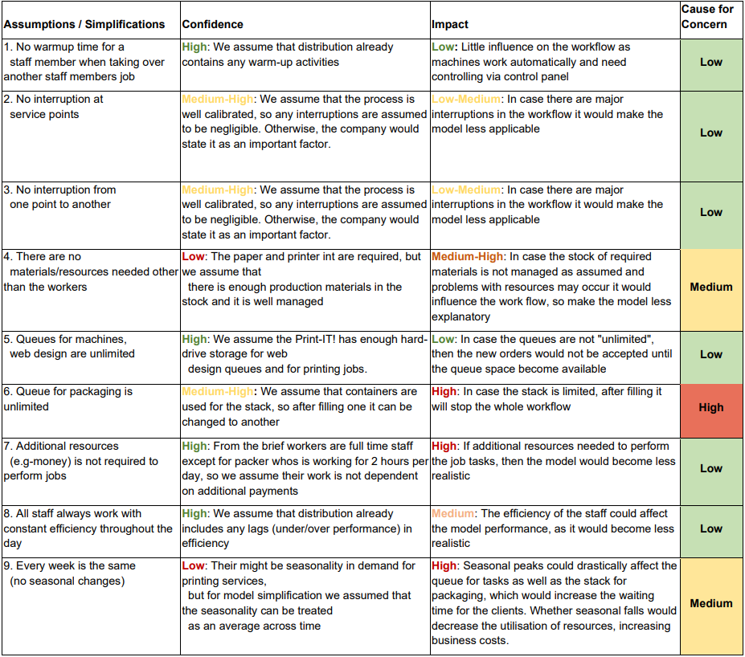            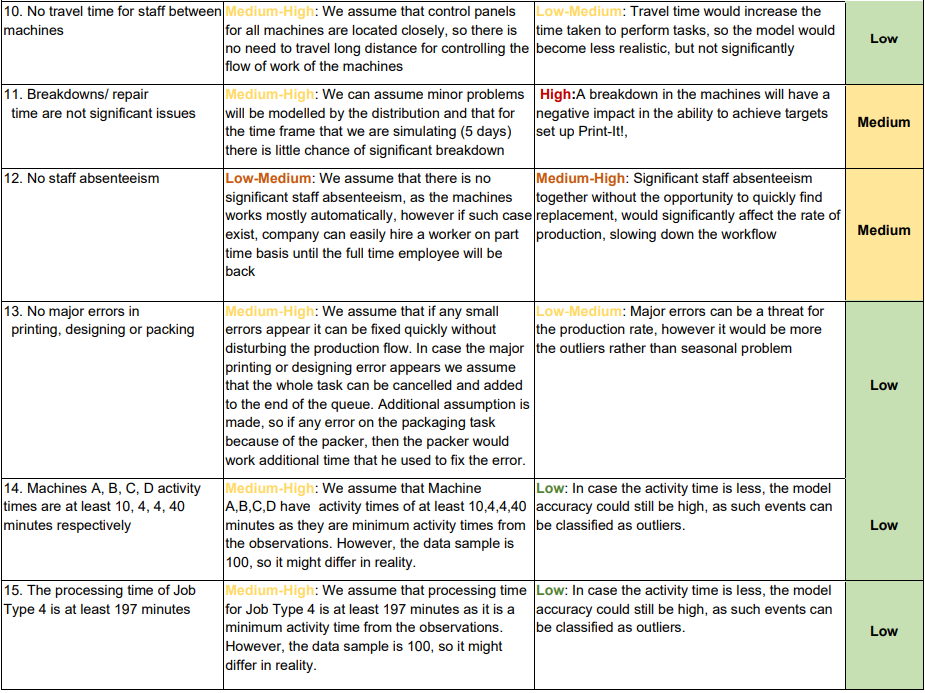

#### **E.2. Verification** 

##### **E.2.1 Step-by-Step Monitor**: 

Following different items and queues live by using the watch window tool, this helps us with output reporting

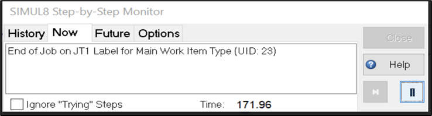

##### **E.2.2 Watch Window:**

This helped us isolate the model to track down errors for individual components of our model.

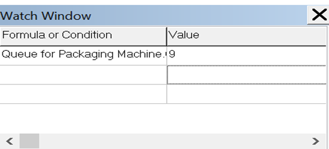

#### **E.3 White Box Validation**

​     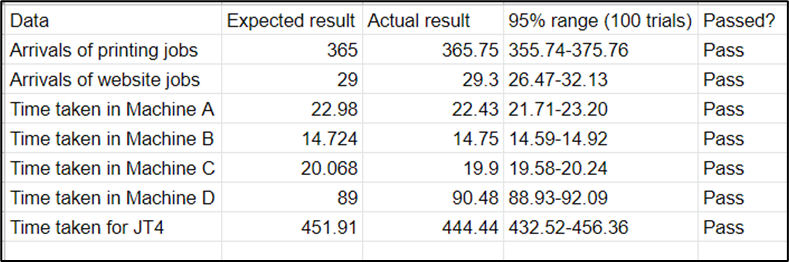

 

#### **E.4 Black Box Validation**

​      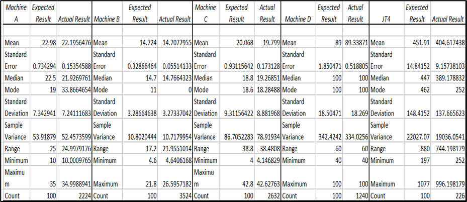